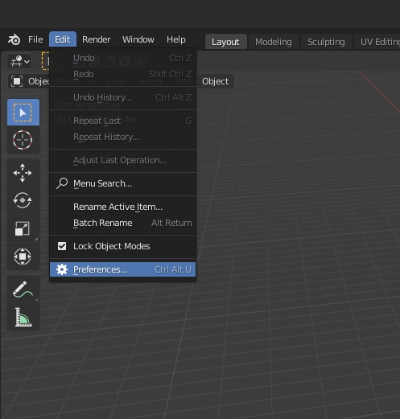
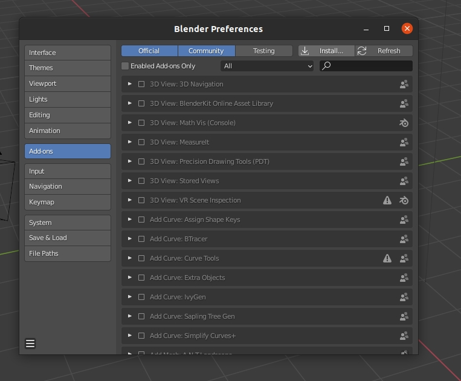

# Camera Set Blender Addon

The *Camera Set* Addon for Blender is an addon for adding the features of having multiple cameras for creating multiple shots with different angles.

# Features

* Set of configurable list of cameras.

* Single button to render all the cameras.

## Motivation
This utility addon was created because I was faced with the issue of having multiple camera in an architecture model of a house. Where I was forced to change the camera variable in between the renders. But I wanted to automated this process so I only needed for all the camera in the scene to be rendered in a single command.

# Installation
Download the [archieve](Release) zip file.

# Examples

## License
This project is licensed under the GPL+3 License - see the [LICENSE](LICENSE) file for details
